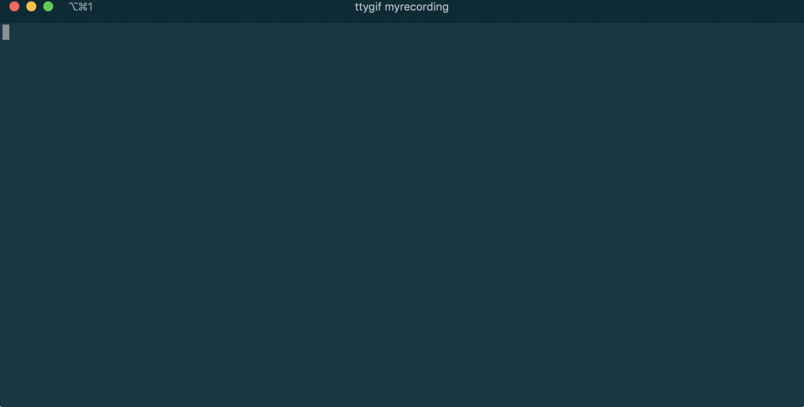

# Program 1
[](https://shields.io/)
> Read a file of records into an array of objects, then loop through the array and print the objects.



**Installation**
---

1. `git clone https://github.com/Gonzalo8642/Template.git`
2. `cd Template`
3. `make`
4. `./assign1`

**Usage example**
---

```
Usage: ./assign1 [OPTIONS]

Options:
  -lockdown  Doesn't actually work
  -v         Just placeholder text.
  -help, -h  Show this message and exit.
```

**Lessons learned**
---

Writing, compiling, and executing a C++ program
